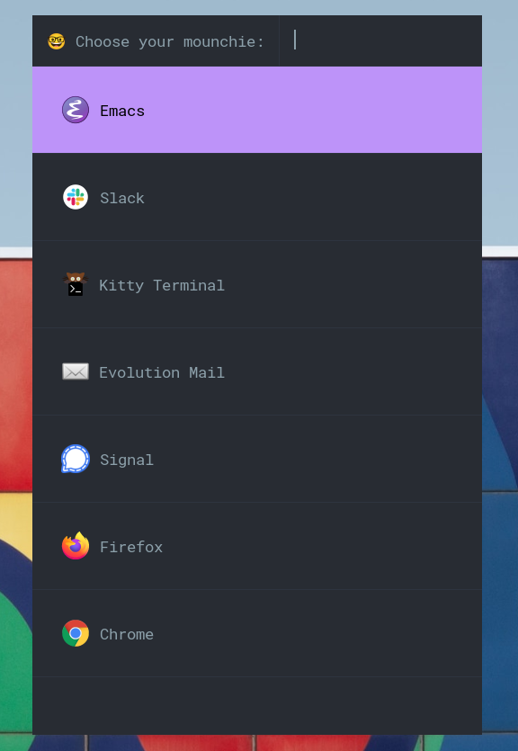

# MOUNCH - a simple ROFI launcher 😋

## Description

Mounch is a simple launcher using [ROFI](https://github.com/davatorium/rofi) on Xorg or [WOFI](https://hg.sr.ht/~scoopta/wofi) on Wayland backed by a yaml configuration file.

You simply define a set of configuration blocks for some custom commands and it will show them with the awesome rofi. The items are sorted by frequency or as the order coming from the
`mounch.yaml` config file.

Why not just use [dmenu](https://frasertweedale.github.io/blog-redhat/posts/2020-12-01-openshift-crio-userns.html#creating-a-user-namespaced-pod---attempt-4) rofi module you may ask ?

* I simply did not want to have to create a `.desktop` file for every apps I have, and find it much simpler to have everything in  a simple yaml definition.
* I did not want to have the launcher offering everythign I have on my system
* I wanted a curated list
* I wanted some title that differs from what's shipped on the .desktop from the system.
* And I wanted to have static ordering as well as frequency based one, which is fitting my workflow.

## Requirements

* [rofi](https://github.com/davatorium/rofi) >= 1.6.0
* [wofi](https://hg.sr.ht/~scoopta/wofi) for wayland
* [PyYaml ](https://pypi.org/project/PyYAML/)

## Screenshot



## Installation

## Arch AUR

* Package available from here: 
    
    https://aur.archlinux.org/packages/mounch/
    
  example config file in /usr/share/doc/mounch and helpers in /usr/share/mounch/
  
  rofi theme is preinstalled in /usr/share/rofi/themes/

## Manual

1. Checkout this repository with git :

        mkdir ~/git/
        git clone https://github.com/chmouel/mounch  ~/git/mounch

2. Copy the theme to your rofi config directory :

        mkdir -p ~/.config/rofi && cp ~/git/mounch/rofi/mounch.rasi ~/.config/rofi/

3. Setup your `mounch.yaml` in `~/.config/mounch/mounch.yaml` look at the example [here](./mounch.yaml).

4. Depending on how you setup your desktop setup a key to launch the [main script](./mounch.py)
   in `~/git/mounch/mounch.py` if you have followed thru.

5. Install [pyyaml](https://pypi.org/project/PyYAML/) python library (which you
   probably have already), packages are called

## Configuration

The basic defintion look like this :

```yaml
firefox:
  binary: gtk-launch
  args: firefox
  description: "Firefox"
  icon: firefox
```

You are starting by a unique id as a key from this yaml snippet called firefox,
you launch a binary called
[gtk-launch](https://developer.gnome.org/gtk3/stable/gtk-launch.html) which is a
standard gtk tool who launch your desktop application, you give the args
`firefox` and you use the icon firefox which is picked up from your local icon
files.

* args can be a list, ie:
    args: `["firefox", "https://linux.com/"]`

* binaries are looked into your path.
* the icons is the standard freedesktop ones, add new ones in for example:

    `~/.local/share/icons/hicolor/scalable/apps/`

see a most complete example [here](./mounch.yaml).


## Misc

* **License**: [Apache License](./LICENSE)
* **Authors**: Chmouel Boudjnah <chmouel@chmouel.com>
